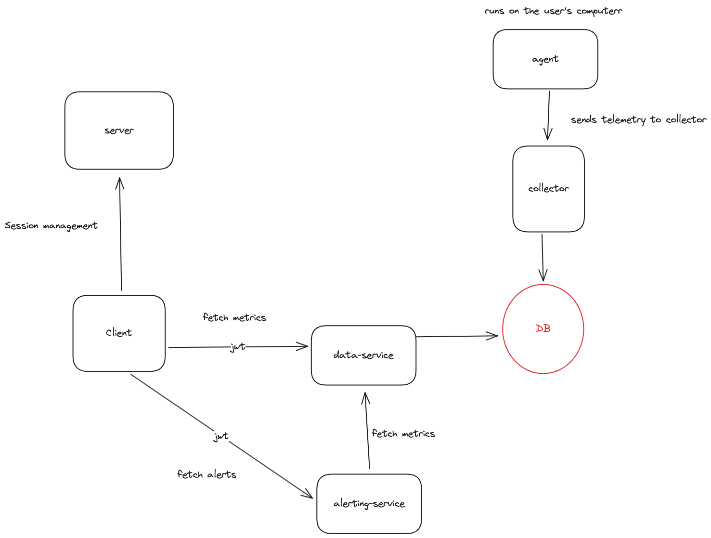

# Observability System POC

## Overview

This Proof of Concept (POC) aims to demonstrate my ability to build a fully functional observability system with a strong emphasis on front-end architecture and design.

**Note:** Due to time constraints, some backend services may not be as clean or refined as they could be. This includes areas such as file system database, typing and the presence of hardcoded values. I apologize for any inconvenience this may cause.

## Getting Started

### Prerequisites

Ensure you have the following installed:

- Node.js (v20.0.0 or higher)
- npm (v9 or higher)
- OSX (it should work on Windows, but I've not tested it)

### Installation

In the root folder

1. Install dependencies for the front-end and each backend service by runnings these commands

   ```bash
   npm run install
   npm run bootstrap
   ```

2. Run all services:

   ```bash
   npm run dev
   ```
**If there is an error while running client make sure to**
   1. Remove the "node_modules" in the client folder
   2. Run `npm i` in the client folder


### Usage

The front-end application can be accessed at `http://localhost:5173`.
User is `admin` and password is `admin`.
**Note**:
To simulate heavy CPU load I recommend using `stress --cpu {number_of_cpus} --timeout 999` [Link](https://formulae.brew.sh/formula/stress).

### Assignment scope

- Client is located in `services/client` and unit tests are located in `services/client/src/features/hosts/pages/widgets/cpu-load-time-series.test.tsx`
- Alerting logic with test is located in `services/alerting/src/actions/active-alerts`
- Business logic about calculating high average load with test is located in `services/data/src/actions/cpu-load-events`
- Metrics are generated in `services/data/src/actions/metrics`

Everything else is a bonus (out of scope).

## Before deploying to production

Before going live, couple of remarks what needs to be added

- Remove "noImplicitAny" from `tsconfig`
- Internationalization
- Add more unit & integration tests
- Add breadcrumbs
- Move inline CSS styles to separate files and polish them
- Migrate to `useQuery` and remove the `HostProvider` (alternative tackle state management using Redux/...)
- Add build pipeline (CircleCI/Github Actions)
  - **Make sure to create automated strict rules of dependencies for feature folders so we avoid importing files from other feature teams!** (https://www.npmjs.com/package/dependency-cruiser). Alternative we could introduce isolated packages for each feature folders or going even further with micro frontend architecture.

## Architecture



Here you can find the [real world example of observability architecture](docs/REAL_WORLD_ARCHITECTURE.png)

## Walkthrough

Here is my walkthrough of the application and it's architecture [https://www.youtube.com/watch?v=cIFH9-gAMMk](https://www.youtube.com/watch?v=cIFH9-gAMMk)
